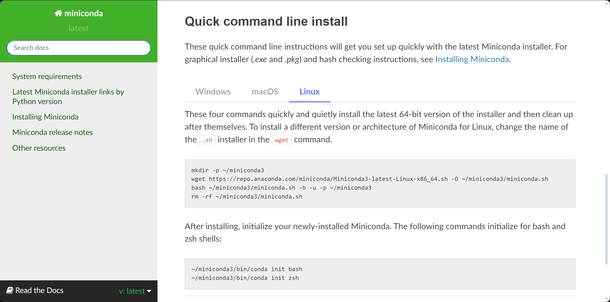

# Software List

- [Software List](#software-list)
  - [Computer Vision](#computer-vision)
    - [OpenCV](#opencv)
    - [OpenVINO](#openvino)
  - [Conda](#conda)
    - [Anaconda](#anaconda)
    - [Miniconda](#miniconda)
  - [CUDA](#cuda)
    - [WSL](#wsl)
  - [DataSpell](#dataspell)
  - [Deep Learning Framework](#deep-learning-framework)
    - [Caffe](#caffe)
    - [Keras](#keras)
    - [PyTorch](#pytorch)
    - [TensorFlow](#tensorflow)
  - [Git](#git)
  - [Jupyter](#jupyter)
  - [NLP](#nlp)
    - [LLM](#llm)
      - [Llama-v2](#llama-v2)
  - [PyCharm Community](#pycharm-community)
  - [PyCharm Professional](#pycharm-professional)
  - [Python](#python)

## Computer Vision

### OpenCV

* [Install](https://opencv.org/get-started/)
  
* [Home](https://opencv.org/)

### OpenVINO

* [Install](https://docs.openvino.ai/2023.2/openvino_docs_install_guides_overview.html)
  

* [Install from intel](https://www.intel.com/content/www/us/en/developer/tools/openvino-toolkit/download.html)
  

* [Get Started](https://docs.openvino.ai/2023.2/home.html)

* [Intel® Distribution of OpenVINO™ Toolkit](https://www.intel.com/content/www/us/en/developer/tools/openvino-toolkit/overview.html)

* [Github OpenVINO™ Notebooks](https://github.com/openvinotoolkit/openvino_notebooks)

* [Github OpenVINO toolkit](https://github.com/openvinotoolkit/openvino)

## Conda

[Download & Install](https://docs.conda.io/projects/conda/en/latest/user-guide/install/download.html#) (Anoconda/MiniConda)
  

### Anaconda

* [Download Installer](https://www.anaconda.com/download#downloads) ([Windows](https://www.anaconda.com/download)/MAC/Linux)]
  
  

* [Install](https://docs.anaconda.com/free/anaconda/install)（[Windows](https://docs.anaconda.com/free/anaconda/install/windows/)/[MAC](https://docs.anaconda.com/free/anaconda/install/mac-os/)/[Linux](https://docs.anaconda.com/free/anaconda/install/linux/)）
  

  ### Miniconda

* [Download Installer](https://docs.conda.io/projects/miniconda/en/latest/) (Windows/MAC/Linux)
  

* [Download & Install Command Line](https://docs.conda.io/projects/miniconda/en/latest/) (Windows/MAC/Linux)
  

## CUDA

### [WSL](https://docs.nvidia.com/cuda/wsl-user-guide/index.html#)

* [Install](https://developer.nvidia.com/cuda-downloads?target_os=Linux&target_arch=x86_64&Distribution=WSL-Ubuntu&target_version=2.0&target_type=deb_local)
  

## DataSpell

* [Download](https://www.jetbrains.com/dataspell/)

## Deep Learning Framework

### Caffe

### Keras

### PyTorch

* [Install](https://pytorch.org/get-started/locally/)
  

### TensorFlow

## Git

* [Download](https://git-scm.com/download/win)

## Jupyter

* [Install & Run](https://jupyter.org/install)
* [Home](https://jupyter.org/)
* [Hello World](https://waterprogramming.wordpress.com/2018/01/13/jupyter-notebook-a-hello-world-overview/)

## NLP

### LLM

#### Llama-v2

* [Open Source Announcement](https://x.com/ylecun/status/1681336284453781505?s=46)
* [Github Llama](https://github.com/facebookresearch/llama)
* [Github PurpleLlama](https://github.com/facebookresearch/PurpleLlama)
* [Github CodeLlama](https://github.com/facebookresearch/codellama)
* [Introduction](https://ai.meta.com/llama/)
* [Paper](https://ai.meta.com/research/publications/llama-2-open-foundation-and-fine-tuned-chat-models/)
* [Download the Model](https://ai.meta.com/resources/models-and-libraries/llama-downloads/)
  
  * Llama
    
  * Code Llama
    
  * Purple Llama
    

## PyCharm Community

* [Download](https://www.jetbrains.com/pycharm/download/?section=windows)

## PyCharm Professional

* [Download](https://www.jetbrains.com/pycharm/download/?section=windows)

## Python

* [Download](https://www.python.org/downloads/)
