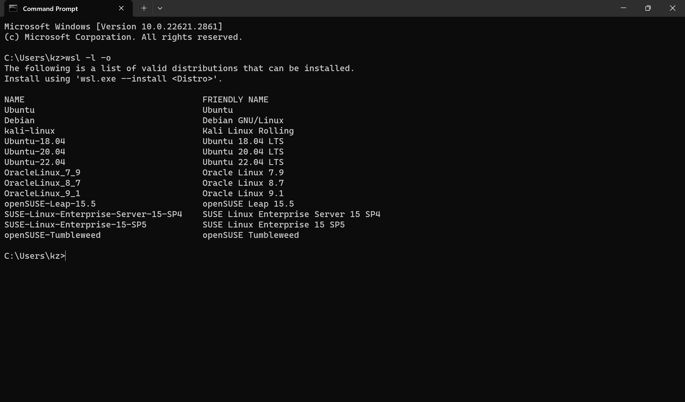

# [WSL (Windows Subsystem for Linux)](https://learn.microsoft.com/en-us/windows/wsl/)

- [WSL (Windows Subsystem for Linux)](#wsl-windows-subsystem-for-linux)
  - [Frequently Used Command](#frequently-used-command)
    - [Get supported WSL Ubuntu distribution](#get-supported-wsl-ubuntu-distribution)
    - [Install Linux on Windows with WSL](#install-linux-on-windows-with-wsl)
      - [Command Prompt](#command-prompt)
      - [Microsoft Store](#microsoft-store)
    - [Set WSL1/WSL2](#set-wsl1wsl2)
    - [Installed WSL Ubuntu Distribution](#installed-wsl-ubuntu-distribution)
      - [Command Prompt](#command-prompt-1)
      - [Installed APP](#installed-app)
    - [Launch WSL Ubuntu](#launch-wsl-ubuntu)
      - [Command Prompt](#command-prompt-2)
      - [Windows Key](#windows-key)
      - [Launch specified distribution](#launch-specified-distribution)
      - [Set default distribution](#set-default-distribution)
    - [Terminate a distribution](#terminate-a-distribution)
    - [Uninstall a distribution](#uninstall-a-distribution)
  - [Basic commands for WSL](#basic-commands-for-wsl)
  - [Configuration](#configuration)
    - [Memory limit](#memory-limit)
  - [Issues \& Fixes](#issues--fixes)
    - [NAT Mode does not support localhost proxies](#nat-mode-does-not-support-localhost-proxies)

## Frequently Used Command

### Get supported WSL Ubuntu distribution

`wsl -l -o`



### [Install Linux on Windows with WSL](https://learn.microsoft.com/en-us/windows/wsl/install)

#### Command Prompt

`wsl --install Ubuntu-22.04`


#### Microsoft Store


### Set WSL1/WSL2

* Set WSL1/WSL2
  
* Turn it on and restart before setting WSL1, not required for WSL2
  

### Installed WSL Ubuntu Distribution

#### Command Prompt

`wsl -l`


#### Installed APP


### Launch WSL Ubuntu

#### Command Prompt


#### Windows Key


#### Launch specified distribution

`wsl -d Ubuntu-22.04`


#### Set default distribution

`wsl --set-default Ubuntu-22.04`


### Terminate a distribution


### Uninstall a distribution

* step 1
  
* step 2
  

## [Basic commands for WSL](https://learn.microsoft.com/en-us/windows/wsl/basic-commands)

## [Configuration](https://learn.microsoft.com/en-us/windows/wsl/wsl-config)

### Memory limit

* You can configure the memory limit by creating a .wslconfig file in your user folder. Mine's C:\users\kz\.wslconfig (not .wslconfig.txt). Next add the following content to the file:
  
  ```
  [wsl2]
  memory=12GB
  ```

* Now reboot WSL with the command (MUST):
  
  ```
  wsl --shutdown
  wsl
  ```
  
  

* [Constraint](https://learn.microsoft.com/en-us/windows/wsl/wsl-config#main-wsl-settings)
  50% of total memory on Windows or 8GB, whichever is less; on builds before 20175: 80% of your total memory on Windows
  

## Issues & Fixes

### NAT Mode does not support localhost proxies


* Create C:\Users\<your_username>\.wslconfig if not exist.

* Add content to the file:
  
  ```
  [experimental]
  autoMemoryReclaim=gradual
  networkingMode=mirrored
  dnsTunneling=true
  firewall=true
  autoProxy=true
  ```

* Shutdown WSL and reopen
  
  ```
  wsl --shutdown
  wsl
  ```