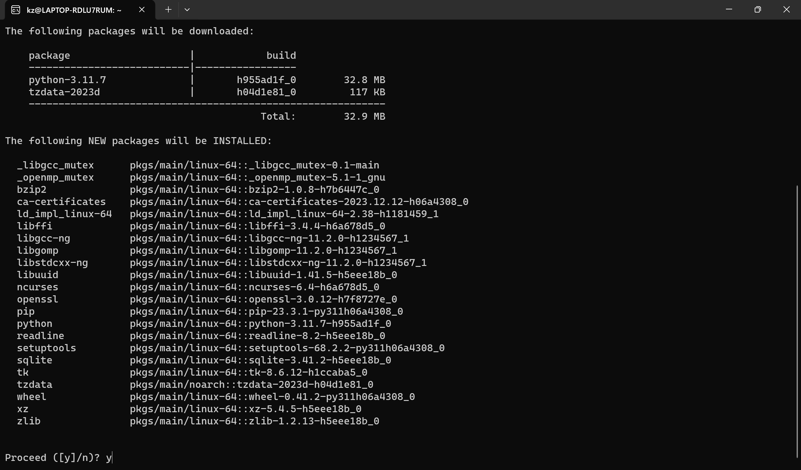
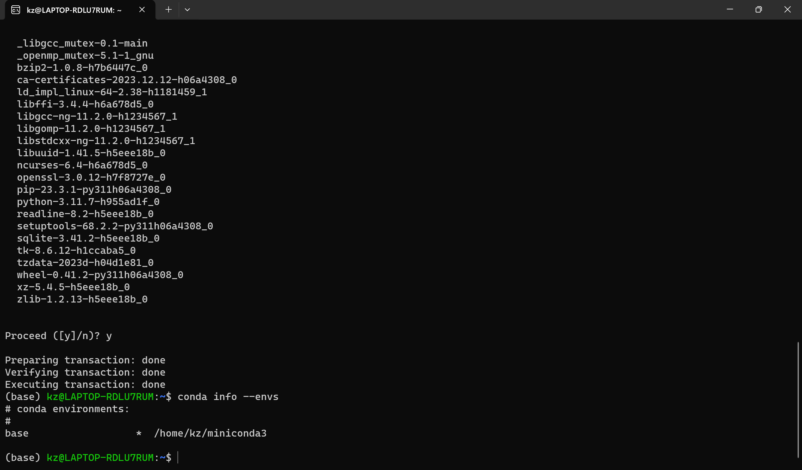
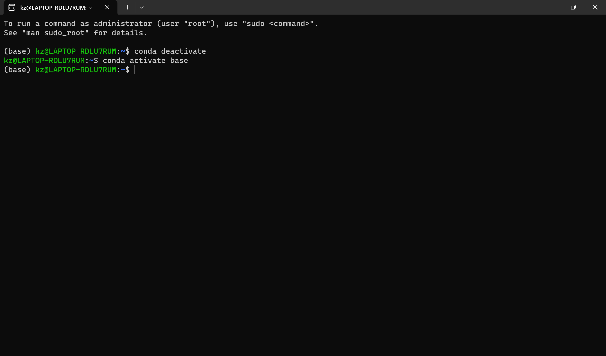

# [Miniconda](https://docs.conda.io/projects/miniconda/en/latest/)

- [Miniconda](#miniconda)
  - [Linux](#linux)
    - [Download \& Install](#download--install)
      - [Option 1](#option-1)
        - [Command list](#command-list)
      - [Option 2](#option-2)
        - [Command list](#command-list-1)
      - [Option 3](#option-3)
    - [Create/Activate/Deactivate/Remove](#createactivatedeactivateremove)
      - [Command list](#command-list-2)
    - [Disable/Deactivate Base Env by default](#disabledeactivate-base-env-by-default)
      - [Option 1](#option-1-1)
        - [Command list](#command-list-3)
      - [Option 2](#option-2-1)
        - [Command list](#command-list-4)
    - [Delete Miniconda](#delete-miniconda)
  - [Windows](#windows)
  - [MacOS](#macos)

## Linux

### Download & Install

#### Option 1

* [Download & Install](https://docs.conda.io/projects/miniconda/en/latest/)


##### Command list

```
mkdir -p ~/miniconda3
wget https://repo.anaconda.com/miniconda/Miniconda3-latest-Linux-x86_64.sh -O ~/miniconda3/miniconda.sh
bash ~/miniconda3/miniconda.sh -b -u -p ~/miniconda3
rm -rf ~/miniconda3/miniconda.sh

~/miniconda3/bin/conda init bash
~/miniconda3/bin/conda init zsh  (optional)

source ~/.bashrc
```

* Steps


#### Option 2

* [Download & Install](https://conda.io/projects/conda/en/latest/user-guide/install/linux.html)


##### Command list

```
wget https://repo.anaconda.com/miniconda/Miniconda3-latest-Linux-x86_64.sh
bash Miniconda3-latest-Linux-x86_64.sh
source ~/.bashrc
```

* Steps


Press space key to scroll screen or q key to the end


#### Option 3

* Download (mirror or browser)

```
wget https://mirrors.tuna.tsinghua.edu.cn/anaconda/miniconda/Miniconda3-latest-Linux-x86_64.sh
```

* Download from browser

[Miniconda home](https://repo.anaconda.com/miniconda/)
[Miniconda tsinghua mirror](https://mirrors.tuna.tsinghua.edu.cn/anaconda/miniconda/)

### Create/Activate/Deactivate/Remove

#### Command list

```
conda info --envs
conda create -n my_virtual_conda_env python=3.11
conda activate my_virtual_conda_env
conda deactivate
conda remove --name my_virtual_conda_env --all
```

* Steps








### Disable/Deactivate Base Env by default

#### Option 1

##### Command list

`conda config --set auto_activate_base false`

or

```
vi ~/.condarc
auto_activate_base: false
```

#### Option 2

##### Command list

```
1. vi ~/.bashrc

2. comment out all lines below

# >>> conda initialize >>>
# !! Contents within this block are managed by 'conda init' !!
__conda_setup="$('/home/kz/miniconda3/bin/conda' 'shell.bash' 'hook' 2> /dev/null)"
if [ $? -eq 0 ]; then
    eval "$__conda_setup"
else
    if [ -f "/home/kz/miniconda3/etc/profile.d/conda.sh" ]; then
        . "/home/kz/miniconda3/etc/profile.d/conda.sh"
    else
        export PATH="/home/kz/miniconda3/bin:$PATH"
    fi
fi
unset __conda_setup
# <<< conda initialize <<<

3. source ~/.bashrc
```

* Deactivate base env once



### Delete Miniconda

* [Deactivate base env by default](#disabledeactivate-base-env-by-default)
* Delete installation folder
  e.g.
  `rm -rf ~/miniconda3/`

## Windows

## MacOS