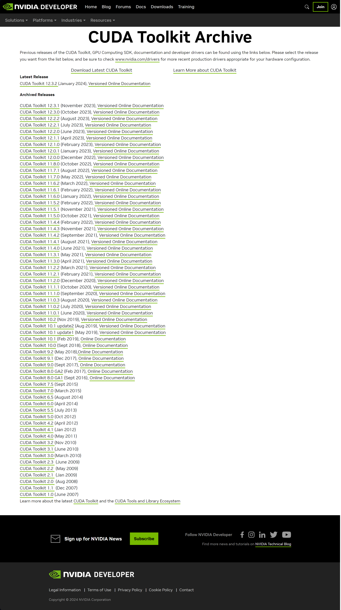
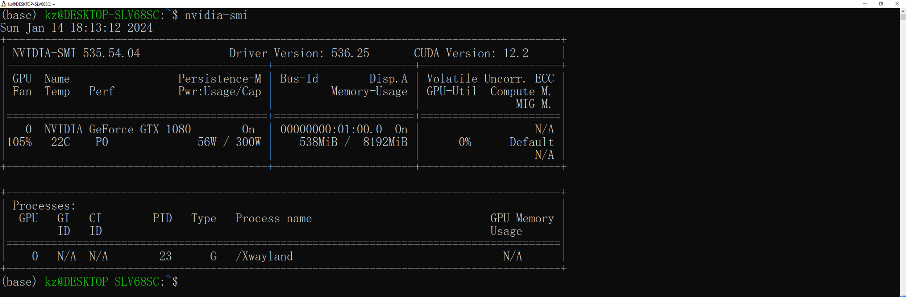
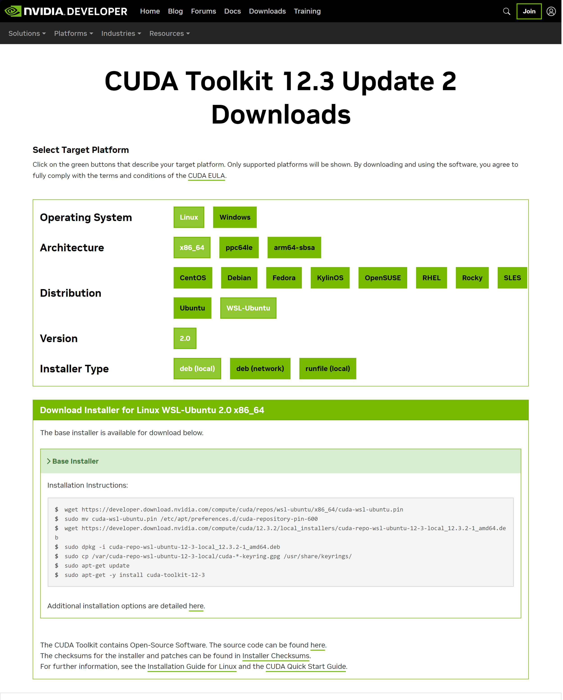
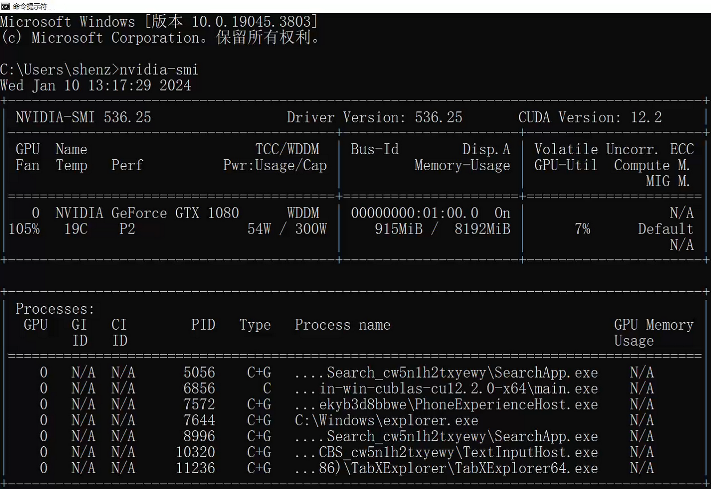
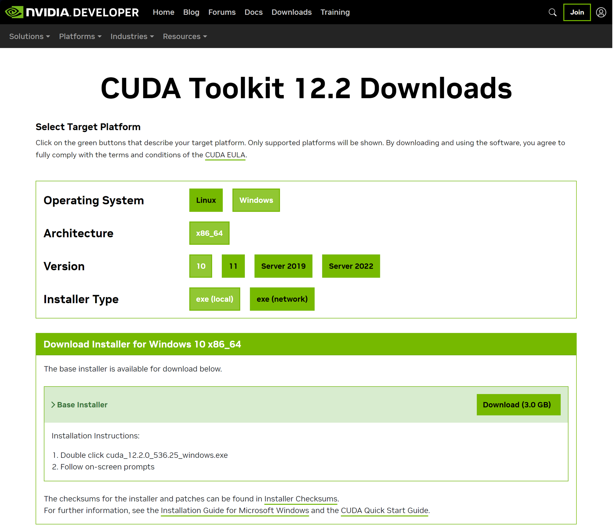

# [CUDA](https://developer.nvidia.com/cuda-toolkit)

- [CUDA](#cuda)
- [All Versions](#all-versions)
  - [Linux](#linux)
  - [Linux (WSL)](#linux-wsl)
    - [Command list](#command-list)
    - [Installation Instructions](#installation-instructions)
  - [Windows](#windows)
    - [Get Driver Version and CUDA Version](#get-driver-version-and-cuda-version)
    - [Download and Install](#download-and-install)
  - [MacOS](#macos)

# [All Versions](https://developer.nvidia.com/cuda-toolkit-archive)



## Linux

TBD

## Linux (WSL)

In command prompt, run command below:

`nvdia-smi`



### Command list

```
wget https://developer.download.nvidia.com/compute/cuda/repos/wsl-ubuntu/x86_64/cuda-wsl-ubuntu.pin
sudo mv cuda-wsl-ubuntu.pin /etc/apt/preferences.d/cuda-repository-pin-600
wget https://developer.download.nvidia.com/compute/cuda/12.3.2/local_installers/cuda-repo-wsl-ubuntu-12-3-local_12.3.2-1_amd64.deb
sudo dpkg -i cuda-repo-wsl-ubuntu-12-3-local_12.3.2-1_amd64.deb
sudo cp /var/cuda-repo-wsl-ubuntu-12-3-local/cuda-*-keyring.gpg /usr/share/keyrings/
sudo apt-get update
sudo apt-get -y install cuda-toolkit-12-3
```

### [Installation Instructions](https://developer.nvidia.com/cuda-downloads?target_os=Linux&target_arch=x86_64&Distribution=WSL-Ubuntu&target_version=2.0&target_type=deb_local)



## Windows

### Get Driver Version and CUDA Version

In command prompt, run command below:

`nvdia-smi`



### Download and Install



## MacOS

TBD