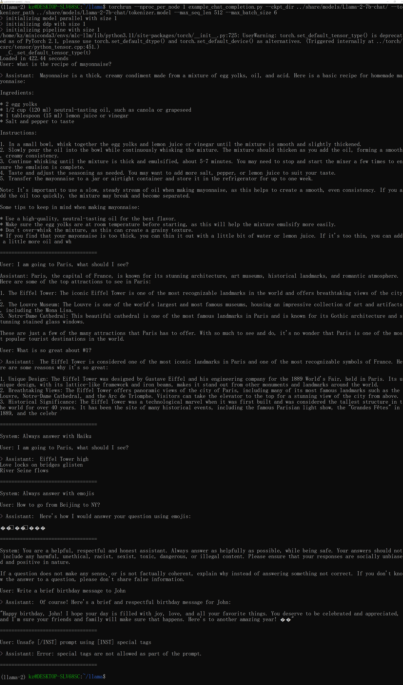
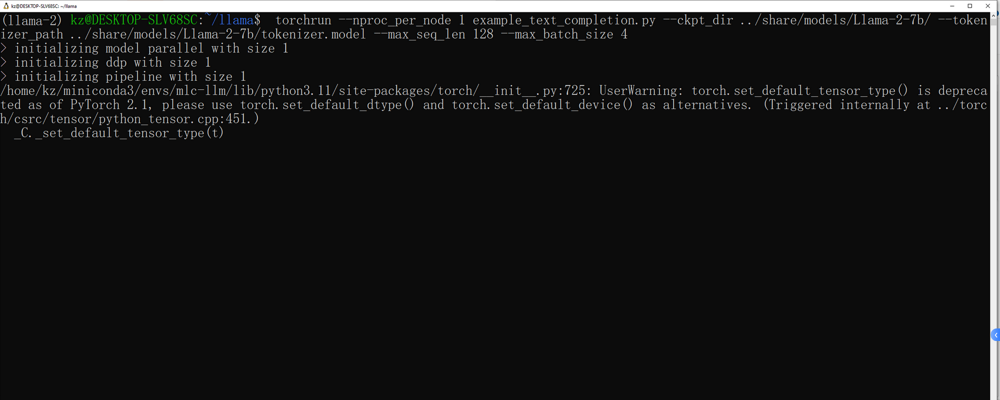
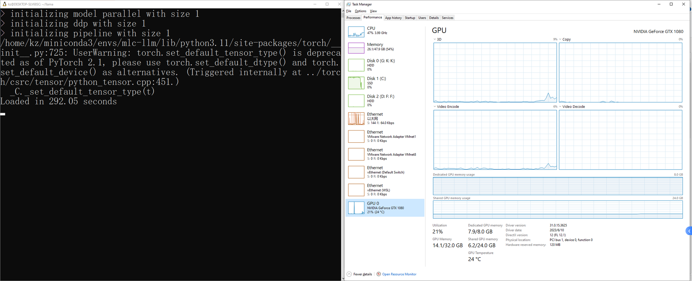

# Llama2 Distribution

- [Llama2 Distribution](#llama2-distribution)
  - [Install WSL](#install-wsl)
  - [Install Miniconda](#install-miniconda)
  - [Download Model](#download-model)
  - [Download Llama2](#download-llama2)
  - [Install Dependency](#install-dependency)
  - [Run Interface](#run-interface)
  - [Errors](#errors)
    - [Due to Host Memory Size (16G), Not GPU Memory Size](#due-to-host-memory-size-16g-not-gpu-memory-size)
    - [Run example\_text\_completion with Max\_Batch\_Size 4](#run-example_text_completion-with-max_batch_size-4)

## Install WSL

Refer to [002_WSL](../../00_Setup/Notes/002_WSL.md)

## Install Miniconda

```
wget https://repo.anaconda.com/miniconda/Miniconda3-latest-Linux-x86_64.sh
./Miniconda3-latest-Linux-x86_64.sh
```

For more detail, refer to [003_Miniconda](../../00_Setup/Notes/003_Miniconda.md)

## Download Model

```
git clone https://huggingface.co/meta-llama/Llama-2-7b
git clone https://huggingface.co/meta-llama/Llama-2-7b-chat
```

## Download Llama2

```
git clone https://github.com/facebookresearch/llama.git
```

## Install Dependency

```
cd llama
sudo pip install -e .
```

## Run Interface

* Run example_text_completion.py
  
  ```
  torchrun --nproc_per_node 1 example_text_completion.py --ckpt_dir ../share/models/Llama-2-7b/ --tokenizer_path ../share/models/Llama-2-7b/tokenizer.model --max_seq_len 128 --max_batch_size 4
  ```
  
  
  
  
  
  

* Run example_chat_completion.py
  
  ```
  torchrun --nproc_per_node 1 example_chat_completion.py --ckpt_dir ../share/models/Llama-2-7b-chat/ --tokenizer_path ../share/models/Llama-2-7b-chat/tokenizer.model --max_seq_len 512 --max_batch_size 6
  ```
  
  
  
  

## Errors

### Due to Host Memory Size (16G), Not GPU Memory Size
* Error Message
![00_CUDA_Out_Of_Memory_Error]
(../00_Llama/Images/00_Llama2_Distribution_On_WSL/00_CUDA_Out_Of_Memory_Error.png)
* Memory Usage Change


### Run example_text_completion with Max_Batch_Size 4


