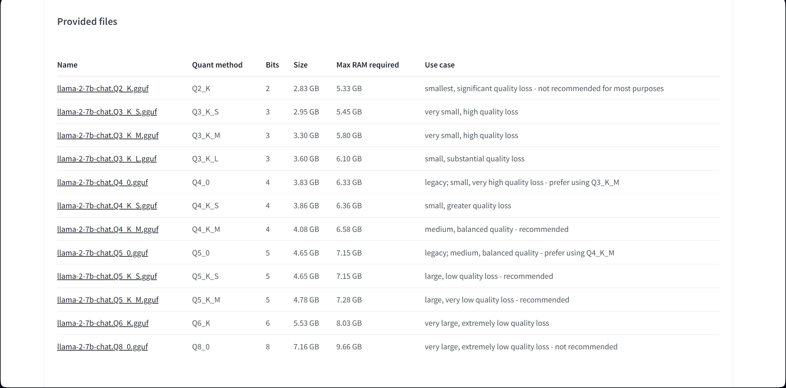
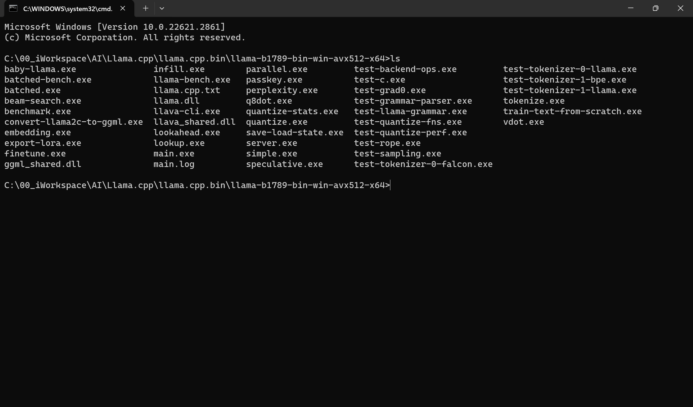

# Simplest way to distribute Llama 2

- [Simplest way to distribute Llama 2](#simplest-way-to-distribute-llama-2)
  - [Llama.cpp + GGUF models](#llamacpp--gguf-models)
  - [Download list](#download-list)
  - [Command list](#command-list)
- [Step by Step](#step-by-step)
  - [Download Llama.cpp binary](#download-llamacpp-binary)
    - [Check AVX2/AVX512 of CPU](#check-avx2avx512-of-cpu)
  - [Download GGUF format models](#download-gguf-format-models)
  - [Download prompt transcript](#download-prompt-transcript)
  - [All files downloaded](#all-files-downloaded)
  - [Potential dependency](#potential-dependency)
  - [Run interface in command line](#run-interface-in-command-line)
    - [Open Command Line Prompt](#open-command-line-prompt)
    - [One time interaction](#one-time-interaction)
    - [Interactive mode](#interactive-mode)
    - [Interactive bob chat mode](#interactive-bob-chat-mode)

## [Llama.cpp](https://medium.com/@phillipgimmi/what-is-gguf-and-ggml-e364834d241c) + [GGUF models](https://medium.com/@phillipgimmi/what-is-gguf-and-ggml-e364834d241c)

## Download list

```
https://github.com/ggerganov/llama.cpp/releases
https://www.cpuid.com/softwares/cpu-z.html
https://raw.githubusercontent.com/ggerganov/llama.cpp/master/prompts/chat-with-bob.txt
```

Choose the one matching your CPU

```
https://huggingface.co/TheBloke/Llama-2-7B-Chat-GGUF/tree/main
https://huggingface.co/TheBloke/Llama-2-13B-chat-GGUF/tree/main
https://huggingface.co/TheBloke/Llama-2-70B-Chat-GGUF/tree/main
```

## Command list

```
.\main.exe -m ..\llama-2-7b-chat.Q4_K_M.gguf -p "How big is the moon" -n 1024
.\main.exe -m ..\llama-2-7b-chat.Q4_K_M.gguf -ins
.\main.exe -m ..\llama-2-7b-chat.Q4_K_M.gguf -n -1 --repeat_penalty 1.0 --color -i -r "User:" -f ..\chat-with-bob.txt
```

# Step by Step

## [Download Llama.cpp binary](https://github.com/ggerganov/llama.cpp/releases)


If you wnat to build it by yourself, refer to [Build Llama.cpp](https://github.com/linuslau/AI/blob/main/01_Foolproof_Guide_of_LLama_Deployment/01_Llama.cpp_on_CPU/01_Build_Llama.cpp.md)

### Check AVX2/AVX512 of CPU

* [Download CPUZ](https://www.cpuid.com/softwares/cpu-z.html)


* AVX2/AVX512 Check


* [Download Llama.cpp binary](#download-llamacpp-binary)

## Download GGUF format models

* [Llama-2-7B-Chat-GGUF](https://huggingface.co/TheBloke/Llama-2-7B-Chat-GGUF/tree/main)
  
  * Max RAM required
    

* [Llama-2-13B-chat-GGUF](https://huggingface.co/TheBloke/Llama-2-13B-chat-GGUF/tree/main)
  
  * Max RAM required
    

* [Llama-2-70B-Chat-GGUF](https://huggingface.co/TheBloke/Llama-2-70B-Chat-GGUF/tree/main)
  
  * Max RAM required
    
  
  ## Download prompt transcript
  
  * [Download](https://raw.githubusercontent.com/ggerganov/llama.cpp/master/prompts/chat-with-bob.txt)
  
  
  
  ```
  Transcript of a dialog, where the User interacts with an Assistant named Bob. Bob is helpful, kind, honest, good at writing, and never fails to answer the User's requests immediately and with precision.
  
  User: Hello, Bob.
  Bob: Hello. How may I help you today?
  User: Please tell me the largest city in Europe.
  Bob: Sure. The largest city in Europe is Moscow, the capital of Russia.
  User:
  ```
  
  ## All files downloaded
  
  
  
  ## Potential dependency
  
  [MSVC runtime libraries](https://learn.microsoft.com/en-us/cpp/windows/latest-supported-vc-redist?view=msvc-170)
  e.g.
  
  | Architecture | Link                                             | Notes                                                                                                                                                                                                                                                    |
  | ------------ | ------------------------------------------------ | -------------------------------------------------------------------------------------------------------------------------------------------------------------------------------------------------------------------------------------------------------- |
  | ARM64        | https://aka.ms/vs/17/release/vc_redist.arm64.exe | Permalink for latest supported ARM64 version                                                                                                                                                                                                             |
  | X86          | https://aka.ms/vs/17/release/vc_redist.x86.exe   | Permalink for latest supported x86 version                                                                                                                                                                                                               |
  | X64          | https://aka.ms/vs/17/release/vc_redist.x64.exe   | Permalink for latest supported x64 version. The X64 Redistributable package contains both ARM64 and X64 binaries. This package makes it easy to install required Visual C++ ARM64 binaries when the X64 Redistributable is installed on an ARM64 device. |
  
  Download other versions, including long term servicing release channel (LTSC) versions, from [my.visualstudio.com](https://my.visualstudio.com/).

## Run interface in command line

### Open Command Line Prompt

  

### One time interaction

```
.\main.exe -m ..\llama-2-7b-chat.Q4_K_M.gguf -p "How big is the moon" -n 1024
```

  

### Interactive mode

```
.\main.exe -m ..\llama-2-7b-chat.Q4_K_M.gguf -ins
```

  

### Interactive bob chat mode

```
.\main.exe -m ..\llama-2-7b-chat.Q4_K_M.gguf -n -1 --repeat_penalty 1.0 --color -i -r "User:" -f ..\chat-with-bob.txt
```

  
