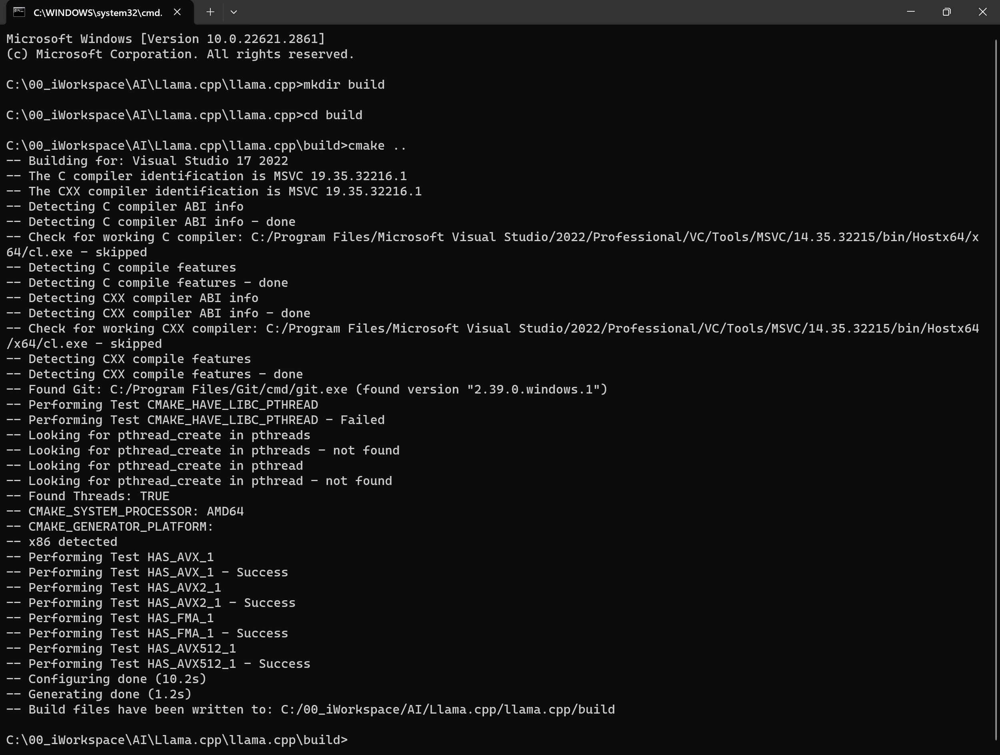
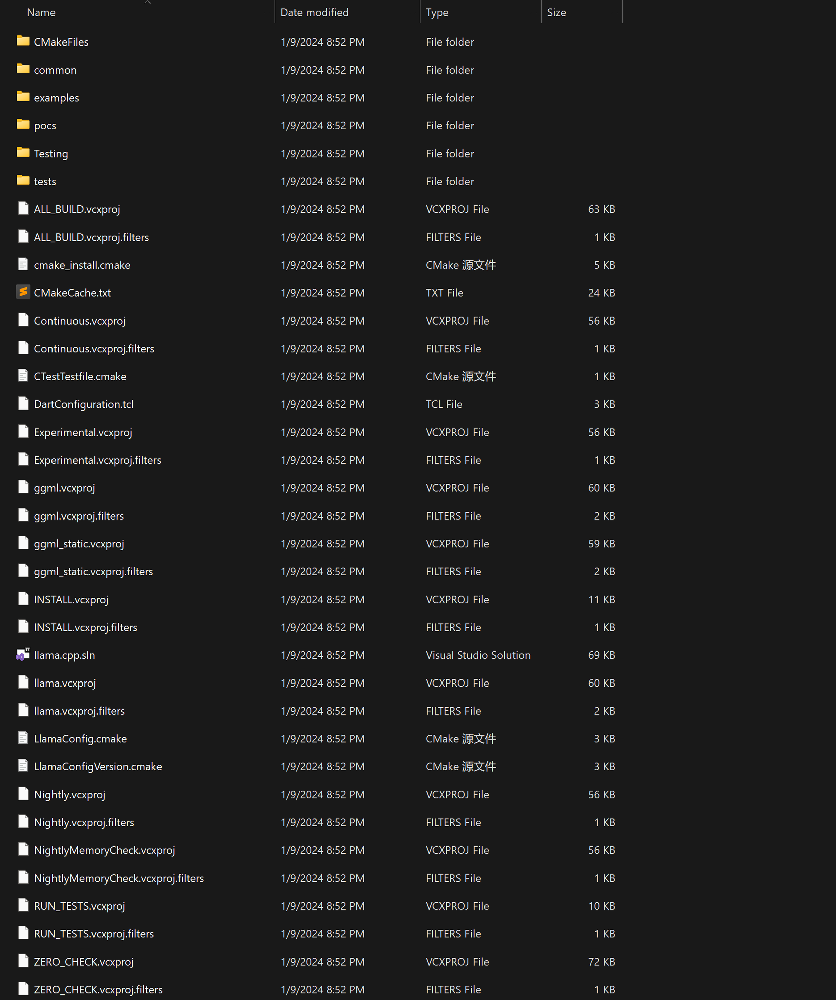
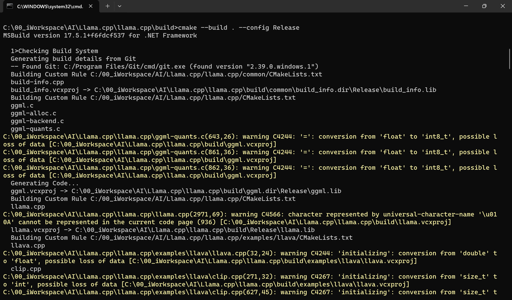
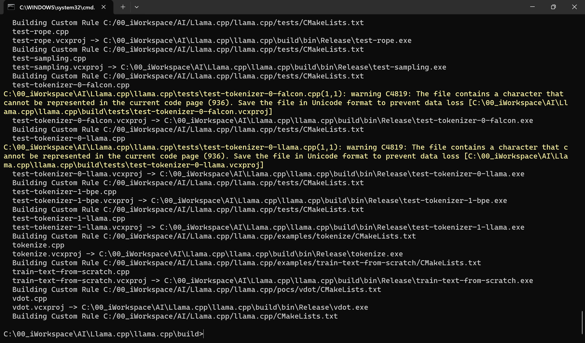
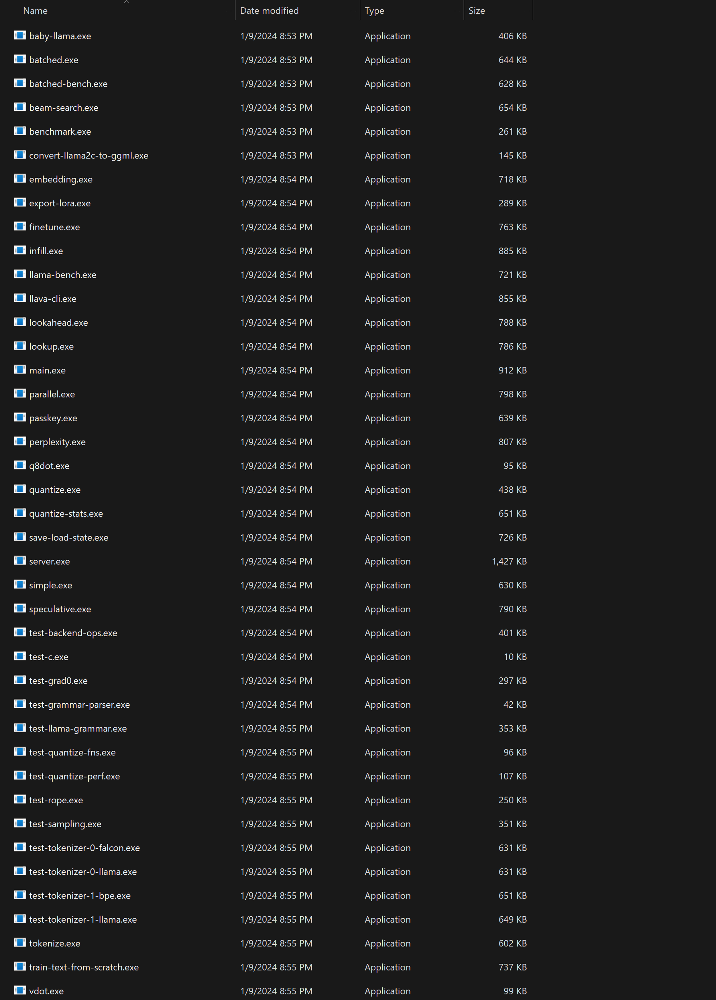

# [Build Llama.cpp](https://github.com/ggerganov/llama.cpp?tab=readme-ov-file#build)

- [Build Llama.cpp](#build-llamacpp)
  - [Using CMake](#using-cmake)
    - [Command list](#command-list)
    - [Step by Step](#step-by-step)
  - [Using make](#using-make)

## Using CMake

### Command list

```
git clone https://github.com/ggerganov/llama.cpp.git
cd llama.cpp

mkdir build
cd build
cmake ..
cmake --build . --config Release
```

### Step by Step

* Install Visual Studio
  e.g. [Visual Studio 17 2022](https://learn.microsoft.com/en-us/visualstudio/releases/2022/release-notes)

* Install CMake
  [Latest Release](https://cmake.org/download/)

* Download [Llama.cpp](https://github.com/ggerganov/llama.cpp)
  `git clone https://github.com/ggerganov/llama.cpp.git`

* Config
  

* Config output
  
  c:\00_iWorkspace\AI\Llama.cpp\llama.cpp\build\

* Build
  
  

* Build output
  
  c:\00_iWorkspace\AI\Llama.cpp\llama.cpp\build\bin\Release\

* Full output
  [CMake_successful_output](./Images/CMake_successful_output.txt)

## Using make

1. Download the latest fortran version of [w64devkit](https://github.com/skeeto/w64devkit/releases).

2. Extract `w64devkit` on your pc.

3. Run `w64devkit.exe`.

4. Use the `cd` command to reach the `llama.cpp` folder.

5. From here you can run:
   
   ```shell
   make
   ```
