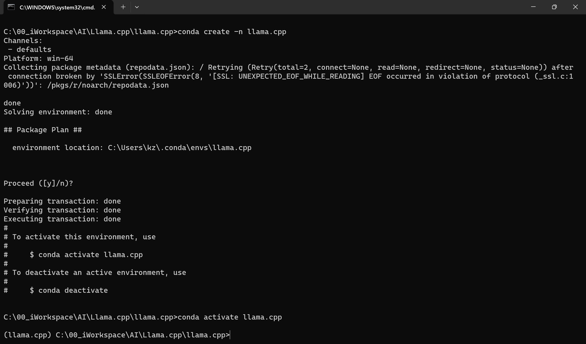
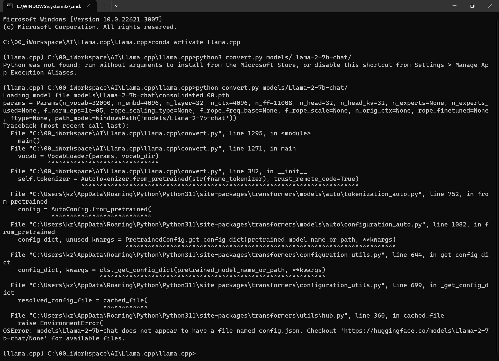
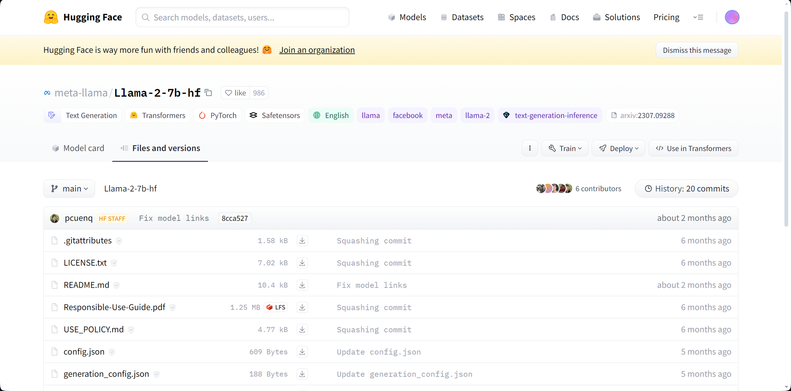
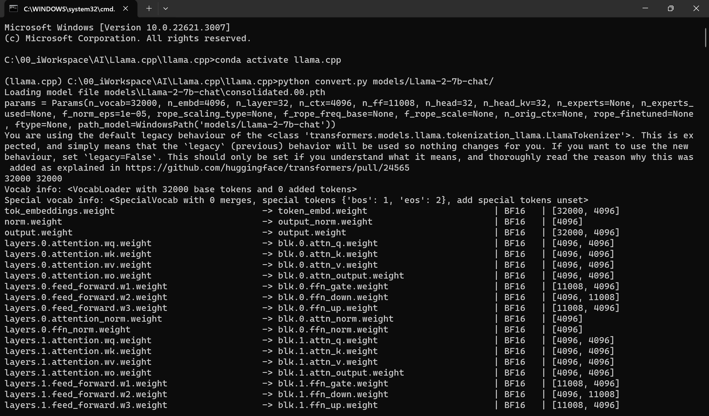
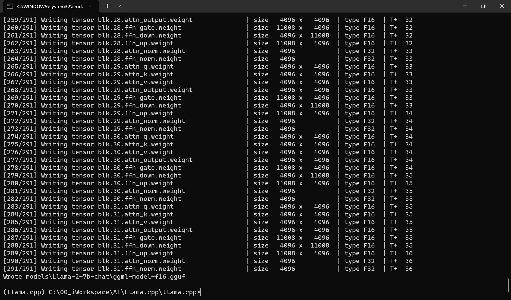
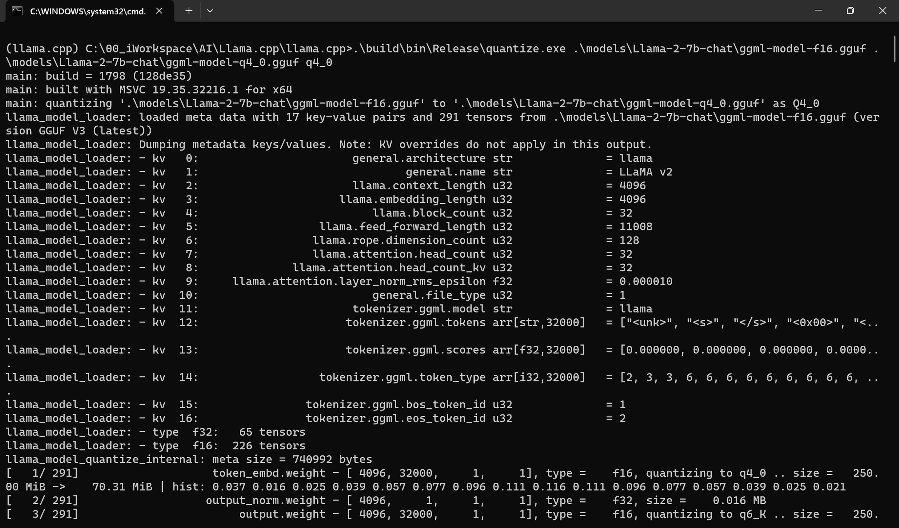
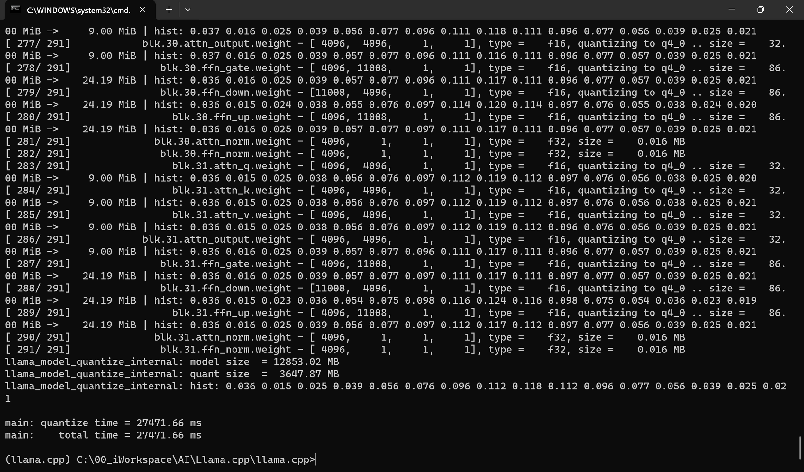
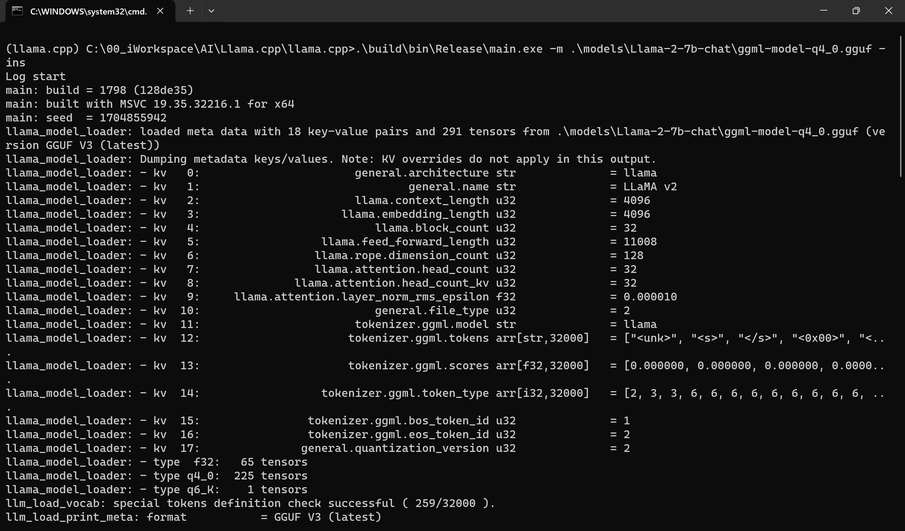
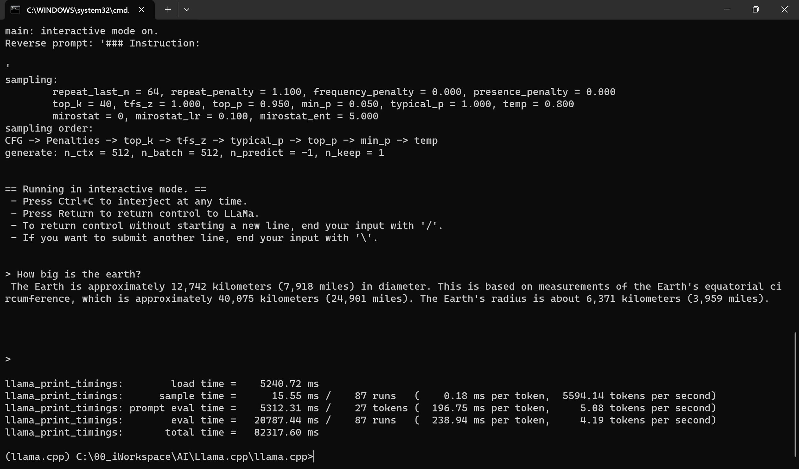

# GGUF Conversion & Quantization

- [GGUF Conversion \& Quantization](#gguf-conversion--quantization)
  - [Command list](#command-list)
  - [Step by step](#step-by-step)
    - [Prerequisites](#prerequisites)
    - [Conversion](#conversion)
    - [Quantization](#quantization)
    - [Run](#run)


## Command list

```
git clone https://huggingface.co/meta-llama/Llama-2-7b
conda create -n llama.cpp
conda activate llama.cp
pip install -r requirements.txt
python convert.py models/Llama-2-7b-chat/
.\build\bin\Release\quantize.exe .\models\Llama-2-7b-chat\ggml-model-f16.gguf .\models\Llama-2-7b-chat\ggml-model-q4_0.gguf q4_0
.\build\bin\Release\main.exe -m .\models\Llama-2-7b-chat\ggml-model-q4_0.gguf -ins
```

## Step by step
### Prerequisites

* Model download
  
  * From huggingface
    
    * 7B
  
      `git clone https://huggingface.co/meta-llama/Llama-2-7b`
      
      Downloaded files
      
      ```
      ./Llama-2-7b-chat$
      [ 13G]  .
      ├── [  51]  tokenizer_checklist.chk
      ├── [488K]  tokenizer.model
      ├── [ 103]  params.json
      ├── [ 13G]  consolidated.00.pth
      ├── [   0]  configuration.json
      ├── [ 102]  checklist.chk
      ├── [4.7K]  USE_POLICY.md
      ├── [1.2M]  Responsible-Use-Guide.pdf
      ├── [ 10K]  README.md
      └── [7.0K]  LICENSE.txt
      
        13G used in 0 directories, 10 files
      ```
    
    * 13B
      `git clone https://huggingface.co/meta-llama/Llama-2-13b`
    
    * 70B
      `git clone https://huggingface.co/meta-llama/Llama-2-70b`
  
  * From meta
    
    TBD

* Conda setup (optional)
  
  TBD

### Conversion

* Prepare data
1. Place the original model in ./models
2. Place tokenizer_checklist.chk tokenizer.model in ./models
   these two files are from original llama model

  Original:

  ```
  ./llama.cpp/models$
  [ 19M]  .
  ├── [1.6M]  ggml-vocab-starcoder.gguf
  ├── [1.7M]  ggml-vocab-stablelm-3b-4e1t.gguf
  ├── [1.6M]  ggml-vocab-refact.gguf
  ├── [1.7M]  ggml-vocab-mpt.gguf
  ├── [707K]  ggml-vocab-llama.gguf
  ├── [1.7M]  ggml-vocab-gpt2.gguf
  ├── [1.7M]  ggml-vocab-gpt-neox.gguf
  ├── [2.4M]  ggml-vocab-falcon.gguf
  ├── [1.3M]  ggml-vocab-baichuan.gguf
  └── [4.6M]  ggml-vocab-aquila.gguf

    19M used in 0 directories, 10 files
  ```

  Modified:

  ```
  ./llama.cpp/models$
  [ 13G]  .
  ├── [  51]  tokenizer_checklist.chk
  ├── [488K]  tokenizer.model
  ├── [1.6M]  ggml-vocab-starcoder.gguf
  ├── [1.7M]  ggml-vocab-stablelm-3b-4e1t.gguf
  ├── [1.6M]  ggml-vocab-refact.gguf
  ├── [1.7M]  ggml-vocab-mpt.gguf
  ├── [707K]  ggml-vocab-llama.gguf
  ├── [1.7M]  ggml-vocab-gpt2.gguf
  ├── [1.7M]  ggml-vocab-gpt-neox.gguf
  ├── [2.4M]  ggml-vocab-falcon.gguf
  ├── [1.3M]  ggml-vocab-baichuan.gguf
  ├── [4.6M]  ggml-vocab-aquila.gguf
  └── [ 13G]  Llama-2-7b-chat
      ├── [  51]  tokenizer_checklist.chk
      ├── [488K]  tokenizer.model
      ├── [ 103]  params.json
      ├── [ 13G]  consolidated.00.pth
      ├── [   0]  configuration.json
      ├── [ 102]  checklist.chk
      ├── [4.7K]  USE_POLICY.md
      ├── [1.2M]  Responsible-Use-Guide.pdf
      ├── [ 10K]  README.md
      └── [7.0K]  LICENSE.txt

    13G used in 1 directory, 22 files
  ```

* Create/Activate conda virtual enviroment (Optional)
  
  ```
  conda create -n llama.cpp
  conda activate llama.cpp
  ```
  

* Install Python dependencies
  
  `python3 -m pip install -r requirements.txt`

* Converting 7B model to GGUF format
  
  `python convert.py models/Llama-2-7b-chat/`
  
  * Error
    
    ```
    OSError: models\Llama-2-7b-chat does not appear to have a file named config.json. Checkout 'https://huggingface.co/models\Llama-2-7b-chat/None' for available files.
    ```
    
    

* [Download](https://huggingface.co/meta-llama/Llama-2-7b-hf/tree/main) config.json and place it to ./llama.cpp/models/Llama-2-7b-chat
  
  
  Your models will be like this:
  
  ```
  ./llama.cpp/models$
  [ 13G]  .
  ├── [  51]  tokenizer_checklist.chk
  ├── [488K]  tokenizer.model
  ├── [1.6M]  ggml-vocab-starcoder.gguf
  ├── [1.7M]  ggml-vocab-stablelm-3b-4e1t.gguf
  ├── [1.6M]  ggml-vocab-refact.gguf
  ├── [1.7M]  ggml-vocab-mpt.gguf
  ├── [707K]  ggml-vocab-llama.gguf
  ├── [1.7M]  ggml-vocab-gpt2.gguf
  ├── [1.7M]  ggml-vocab-gpt-neox.gguf
  ├── [2.4M]  ggml-vocab-falcon.gguf
  ├── [1.3M]  ggml-vocab-baichuan.gguf
  ├── [4.6M]  ggml-vocab-aquila.gguf
  └── [ 13G]  Llama-2-7b-chat
      ├── [  51]  tokenizer_checklist.chk
      ├── [488K]  tokenizer.model
      ├── [ 103]  params.json
      ├── [ 13G]  consolidated.00.pth
      ├── [   0]  configuration.json
      ├── [ 639]  config.json
      ├── [ 102]  checklist.chk
      ├── [4.7K]  USE_POLICY.md
      ├── [1.2M]  Responsible-Use-Guide.pdf
      ├── [ 10K]  README.md
      └── [7.0K]  LICENSE.txt
  
    13G used in 1 directory, 23 files
  ```
  
  Run command below again

  `python convert.py models/Llama-2-7b-chat/`
  
  
  
  [GGUF_Conversion_Full_Output](./Images/02_GGUF_Conversion_&_Quantization/GGUF_Conversion_Full_Output.txt)

### Quantization

Assume you have already [build](./01_Build_Llama.cpp.md) or [download](https://github.com/linuslau/AI/blob/main/01_Foolproof_Guide_of_LLama_Deployment/01_Llama.cpp_on_CPU/00_Simplest_way_to_distribute_Llama2.md#download-llamacpp-binary) llama.cpp binary.

* Quantize the model to 4-bits (using q4_0 method)
  
  `.\build\bin\Release\quantize.exe .\models\Llama-2-7b-chat\ggml-model-f16.gguf .\models\Llama-2-7b-chat\ggml-model-q4_0.gguf q4_0`
  
  
  
  [GGUF_Quantization_Full_Output](./Images/02_GGUF_Conversion_&_Quantization/GGUF_Quantization_Full_Output.txt)
  
  Your models will be like this:
  
  ```
  ./llama.cpp/models$
  [ 29G]  .
  ├── [  51]  tokenizer_checklist.chk
  ├── [488K]  tokenizer.model
  ├── [1.6M]  ggml-vocab-starcoder.gguf
  ├── [1.7M]  ggml-vocab-stablelm-3b-4e1t.gguf
  ├── [1.6M]  ggml-vocab-refact.gguf
  ├── [1.7M]  ggml-vocab-mpt.gguf
  ├── [707K]  ggml-vocab-llama.gguf
  ├── [1.7M]  ggml-vocab-gpt2.gguf
  ├── [1.7M]  ggml-vocab-gpt-neox.gguf
  ├── [2.4M]  ggml-vocab-falcon.gguf
  ├── [1.3M]  ggml-vocab-baichuan.gguf
  ├── [4.6M]  ggml-vocab-aquila.gguf
  └── [ 29G]  Llama-2-7b-chat
      ├── [  51]  tokenizer_checklist.chk
      ├── [488K]  tokenizer.model
      ├── [ 103]  params.json
      ├── [3.6G]  ggml-model-q4_0.gguf
      ├── [ 13G]  ggml-model-f16.gguf
      ├── [ 13G]  consolidated.00.pth
      ├── [   0]  configuration.json
      ├── [ 639]  config.json
      ├── [ 102]  checklist.chk
      ├── [4.7K]  USE_POLICY.md
      ├── [1.2M]  Responsible-Use-Guide.pdf
      ├── [ 10K]  README.md
      └── [7.0K]  LICENSE.txt
  
    29G used in 1 directory, 25 files
  ```

### Run

`.\build\bin\Release\main.exe -m .\models\Llama-2-7b-chat\ggml-model-q4_0.gguf -ins`



[GGUF_Run_Full_Output](./Images/02_GGUF_Conversion_&_Quantization/GGUF_Run_Full_Output.txt)