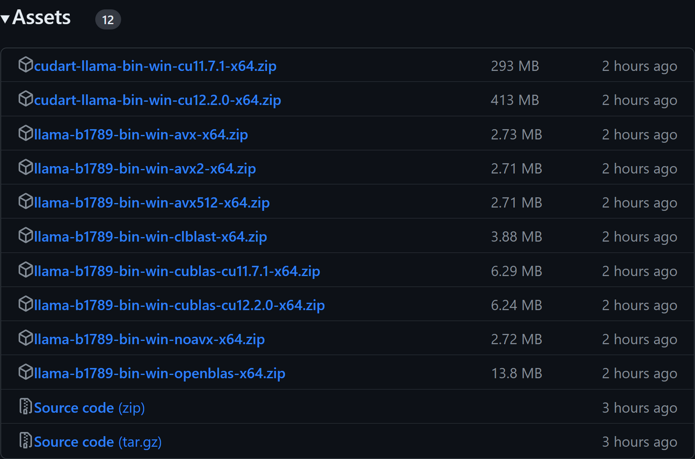

# Llama.cpp (GPU)

- [Llama.cpp (GPU)](#llamacpp-gpu)
  - [Dependencies](#dependencies)
    - [CUDA](#cuda)
    - [Binary Download](#binary-download)
    - [Build Command](#build-command)

Majority of the configuration for GPU is the same as CPU, get detail from [01_Llama.cpp_on_CPU](../01_Llama.cpp_on_CPU/README.md)

## Dependencies

### CUDA

[How to install CUDA Toolkit](../../00_Setup/Notes/004_CUDA.md#windows)

### Binary Download

* [CPU](../01_Llama.cpp_on_CPU/00_Simplest_way_to_distribute_Llama2.md/#download-llamacpp-binary)
* [GPU](https://github.com/ggerganov/llama.cpp/releases)
  

### Build Command

* [CPU](../01_Llama.cpp_on_CPU/01_Build_Llama.cpp.md/#using-cmake)
* [GPU](https://github.com/ggerganov/llama.cpp?tab=readme-ov-file#cublas)
  
Add -DLLAMA_CUBLAS=ON

```
mkdir build
cd build
cmake .. -DLLAMA_CUBLAS=ON
cmake --build . --config Release
```