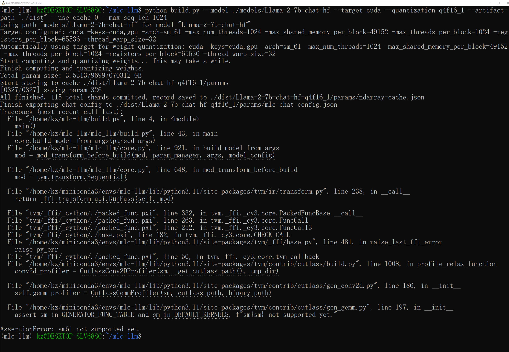
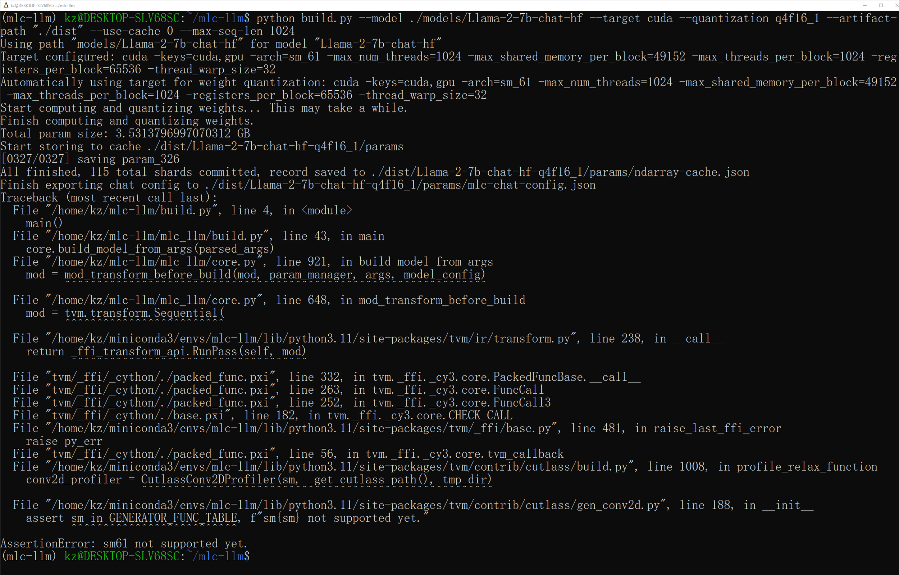
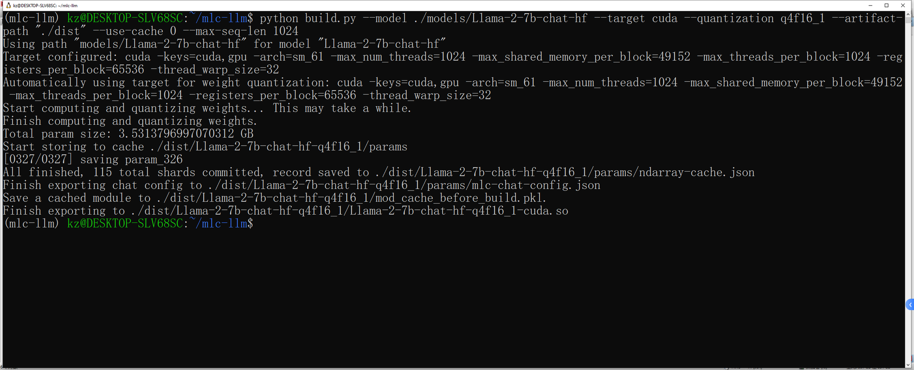
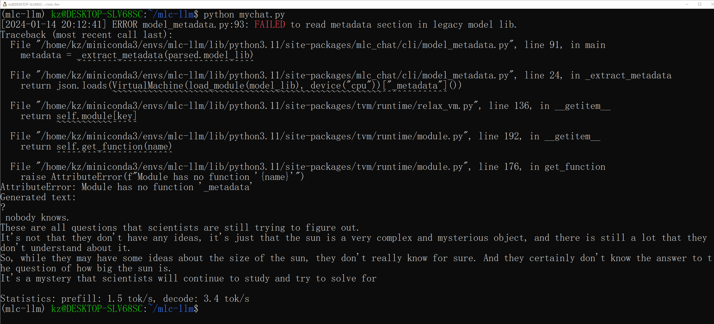

# Distribute Llama2 With MLC-LLM

- [Distribute Llama2 With MLC-LLM](#distribute-llama2-with-mlc-llm)
  - [Install WSL](#install-wsl)
  - [Install Miniconda](#install-miniconda)
  - [Install CUDA on WSL](#install-cuda-on-wsl)
  - [Install MLC-AI, MLC-CHAT, Pytorch](#install-mlc-ai-mlc-chat-pytorch)
  - [Download MLC-LLM](#download-mlc-llm)
  - [Download Llama2 Models](#download-llama2-models)
  - [Build MLC-LLM](#build-mlc-llm)
    - [SM61 not supported yet](#sm61-not-supported-yet)
    - [Build Pass Result](#build-pass-result)
  - [Run MLC-LLM](#run-mlc-llm)
    - [Reference of mychat.py](#reference-of-mychatpy)
    - [Run Chat Result](#run-chat-result)

## Install WSL
Refer to [002_WSL](../../00_Setup/Notes/002_WSL.md)

## Install Miniconda

```
wget https://repo.anaconda.com/miniconda/Miniconda3-latest-Linux-x86_64.sh
./Miniconda3-latest-Linux-x86_64.sh
```

For more detail, refer to [003_Miniconda](../../00_Setup/Notes/003_Miniconda.md)

## Install CUDA on WSL

Refer to [CUDA on WSL](../../00_Setup/Notes/004_CUDA.md/#linux-wsl)

After installation, add cuda to your path:

```
$ vim ~/.bashrc
export PATH=/usr/local/cuda/bin/:$PATH
```

## Install MLC-AI, MLC-CHAT, Pytorch

```
conda create --name mlc-llm python=3.11
conda activate mlc-llm

pip install --pre --force-reinstall mlc-ai-nightly-cu121 mlc-chat-nightly-cu121 -f https://mlc.ai/wheels

pip install --pre torch torchvision --index-url https://download.pytorch.org/whl/nightly/cu121
```

* For Pytorch detail, refer to [Pytorch](../../00_Setup/Notes/001_Software_List.md/#pytorch)
* For MLC-AI, MLC-CHAT installation, if you meet error below

```
WARNING: Retrying (Retry(total=4, connect=None, read=None, redirect=None, status=None)) after connection broken by 'ConnectTimeoutError(<pip._vendor.urllib3.connection.HTTPSConnection object at 0x7fc35bef49d0>, 'Connection timed out. (connect timeout=15)')': /wheels
……
ERROR: Could not find a version that satisfies the requirement mlc-ai-nightly-cu121 (from versions: none)
ERROR: No matching distribution found for mlc-ai-nightly-cu121
```

Download file mannually from [MCL-AI Wheels](https://mlc.ai/wheels)

[mlc_ai_nightly_cu121-0.12.dev2070-cp311-cp311-manylinux_2_28_x86_64.whl](https://github.com/mlc-ai/package/releases/download/v0.9.dev0/mlc_ai_nightly_cu121-0.12.dev2070-cp311-cp311-manylinux_2_28_x86_64.whl)
[mlc_chat_nightly_cu121-0.1.dev806-cp311-cp311-manylinux_2_28_x86_64.whl](https://github.com/mlc-ai/package/releases/download/v0.9.dev0/mlc_chat_nightly_cu121-0.1.dev806-cp311-cp311-manylinux_2_28_x86_64.whl)

Install them manually by command below:

`pip install *.whl`

## Download MLC-LLM

```
git clone --recursive https://github.com/mlc-ai/mlc-llm/
cd mlc-llm/
```

## Download Llama2 Models

```
mkdir models
cd models
git clone https://huggingface.co/meta-llama/Llama-2-7b-chat-hf
```

## Build MLC-LLM

```
python build.py --model ./models/Llama-2-7b-chat-hf --target cuda --quantization q4f16_1 --artifact-path "./dist" --use-cache 0 --max-seq-len 1024
```

### SM61 not supported yet

If you meet error below:

* Error 1



Comment out line 197

```
/home/kz/miniconda3/envs/mlc-llm/lib/python3.11/site-packages/tvm/contrib/cutlass/gen_gemm.py

class CutlassGemmProfiler:
    """Profile all candidate kernels and select the best one."""

    def __init__(self, sm, cutlass_path, binary_path):
        # assert sm in GENERATOR_FUNC_TABLE and sm in DEFAULT_KERNELS, f"sm{sm} not supported yet."
        self.engine = ProfilerEngine(sm, cutlass_path, binary_path)
        self.sm = sm
```

* Error 2



Comment out line 188

```
/home/kz/miniconda3/envs/mlc-llm/lib/python3.11/site-packages/tvm/contrib/cutlass/gen_conv2d.py

class CutlassConv2DProfiler:
    """Profile all candidate kernels and select the best one."""

    def __init__(self, sm, cutlass_path, binary_path):
        self.gemm_profiler = CutlassGemmProfiler(sm, cutlass_path, binary_path)
        self.sm = sm
        # assert sm in GENERATOR_FUNC_TABLE, f"sm{sm} not supported yet."
        self.engine = ProfilerEngine(sm, cutlass_path, binary_path)
        self.cache_path = os.path.join(binary_path, "cutlass_conv2d_cache.pickle")
```

### Build Pass Result



Check so is available

```
(mlc-llm) kz@DESKTOP-SLV68SC:~/mlc-llm$ ls -l ./dist/Llama-2-7b-chat-hf-q4f16_1/Llama-2-7b-chat-hf-q4f16_1-cuda.so
-rwxr-xr-x 1 kz kz 9884680 Jan 14 20:09 ./dist/Llama-2-7b-chat-hf-q4f16_1/Llama-2-7b-chat-hf-q4f16_1-cuda.so
```

## Run MLC-LLM

```
vi mychat.py
python mychat.py
```

### Reference of mychat.py

```
from mlc_chat import ChatModule

cm = ChatModule(model="./dist/Llama-2-7b-chat-hf-q4f16_1/params/", model_lib_path="./dist/Llama-2-7b-chat-hf-q4f16_1/Llama-2-7b-chat-hf-q4f16_1-cuda.so")

output = cm.benchmark_generate("How big is the sun", generate_length=128)

print(f"Generated text:\n{output}\n")
print(f"Statistics: {cm.stats()}")
```

### Run Chat Result

In spite of the error (To check later), reply is also given.


